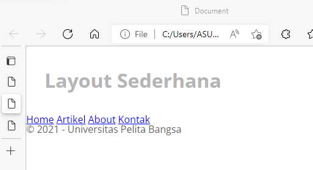

# lab4_box.html
Tugas Pertemuan 5
| Nama | Moch. Nauval Faris Muzaki |
| --- | --- |
| NIM | 312010122 |
| Kelas | TI.20.B1
| Mata Kuliah | Pemrograman Web |

1. **Membuat Box Element dan CSS Float Property**
 
Dilangkah awal ini kita membuat 
dan CCS float property digunakan untuk
membuat layout web dan mudah menentukan posisi atau letak
sebuah elemen HTML.

2. **Mengatur Clearfix Element**
 
Untuk yang selanjutnya Clearfix ini digunakan untuk mengatur element setelah float element. Property clear digunakan untuk
mengaturnya.

3. **Layout Sederhana**
 
Lalu disini kita membaut layout senderhana yaitu kerangka yang mengatur penempatan tata letak sebuah elemen pada
halaman web. Tata letak element seperti navigasi, header, tombol CTA (Call to Action), dan elemen
lainnya pada halaman web, sehingga tampilan web dapat disesuaikan dengan desain yang ada.

4. **Navigasi**
 
jadi Navigasi ini berfungsi Untuk menunjukan menu mana yang akan kita pilih, berikut untuk contohnya

